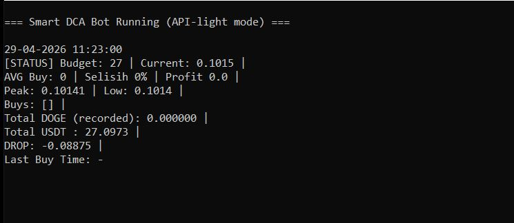

# 🤖 Smart DCA Bot (Binance Edition)

Bot trading DCA (Dollar Cost Averaging) otomatis yang dirancang khusus untuk pasangan DOGE/USDT. Bot ini tidak hanya sekadar membeli saat turun, tapi dilengkapi dengan algoritma cerdas untuk meminimalisir risiko dan memaksimalkan profit saat terjadi rebound.

# 🚀 Fitur Unggulan
Smart Inventory Management: Menggunakan FastAPI-style logic untuk mengelola budget dan layer pembelian.

Dynamic Drop Threshold: Selisih harga beli antar layer akan melebar secara otomatis jika jumlah layer bertambah (mencegah bagging terlalu cepat).

Adaptive Buy Amount: Menyesuaikan jumlah pembelian berdasarkan kondisi market.

Trailing Take Profit: Tidak langsung jual saat target tercapai, tapi memantau puncak harga untuk mendapatkan profit maksimal.

Market Guard:

Anti-Dumping: Menunda pembelian jika harga jatuh terlalu tajam dalam waktu singkat.

Rebound Detection: Memastikan ada pantulan harga sebelum melakukan initial buy.

Sideways Filter: Menghindari transaksi berulang saat market sedang tidak bergerak (flat).

Auto-Cleaning Dashboard: Tampilan terminal yang bersih dan terupdate secara real-time.

# 🛠️ Instalasi
Clone Repository

Bash
git clone https://github.com/taufikyu/smartdcabot.git
cd smart-dca-bot
Install Dependencies

Bash
pip install python-binance
Konfigurasi API
Buka file bot.py dan masukkan API Key serta Secret dari Binance kamu:

Python
API_KEY = 'YOUR_API_KEY'
API_SECRET = 'YOUR_API_SECRET'